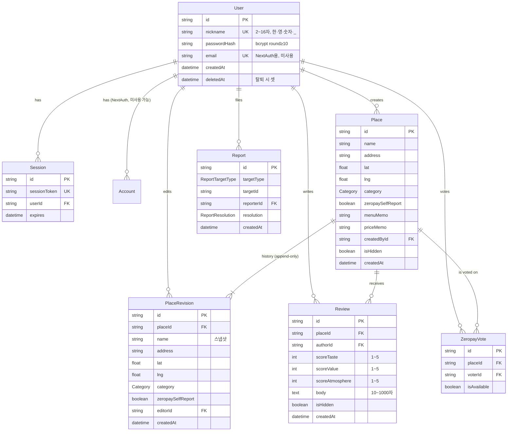

# 제슐렝가이드 데이터 모델 (P1)

> [requirements.md](./requirements.md) F1~F14를 표현하는 Prisma 스키마의 ERD·근거·쿼리 패턴 정리.
> 스키마 본체: [`/prisma/schema.prisma`](../../prisma/schema.prisma)
>
> - **DBMS**: Neon Postgres
> - **ORM**: Prisma
> - **NextAuth**: Credentials Provider + DB 세션 (Prisma Adapter 표준 4개 테이블 유지)

---

## 1. ERD



---

## 2. 핵심 설계 결정

### 2.1 위키식 수정 — Place + PlaceRevision 하이브리드
- `Place`는 **활성 필드를 직접 보유** → 리스트·상세·지도 쿼리가 단일 테이블 lookup으로 끝.
- `PlaceRevision`은 **append-only 스냅샷** → 모든 수정 이력 누적. 첫 등록 시점에도 1건이 함께 생성된다.
- 롤백 = 새 PlaceRevision을 만들고 Place의 활성 필드를 그 값으로 덮어쓰기. 데이터 손실 없음.
- 대안(Place는 메타만, Revision이 모든 필드)을 폐기한 이유: 모든 조회 쿼리가 latest-revision JOIN을 강제 → 비용 대비 이득 없음.

### 2.2 탈퇴 시 닉네임 잔존
- 결정(설계서 6.8): 탈퇴 시 계정만 삭제, 제안·리뷰는 원 닉네임으로 잔존.
- 구현: `User.deletedAt`만 셋. 행은 유지. 제안·리뷰는 `User`에 FK가 살아있으므로 join으로 nickname 조회.
- 로그인·세션은 미들웨어에서 `deletedAt IS NULL`을 강제. (로직 책임)
- 닉네임 충돌 회피도 단순 — `nickname @unique`가 그대로 작동.

### 2.3 NextAuth Adapter 호환
- Credentials Provider만 쓰지만 DB 세션 모드를 위해 Prisma Adapter 표준 4개 테이블(`User`, `Account`, `Session`, `VerificationToken`)을 유지.
- `Account`·`VerificationToken`은 비어있는 채로 둔다 — 향후 OAuth 도입 시 그대로 활용.
- `User.email`은 NextAuth가 unique를 요구하지만 nullable. 수집은 안 함.

### 2.4 신고·자동 숨김
- `Report`는 `(targetType, targetId, reporterId)` unique → 1인 1신고.
- 자동 숨김 로직: 신고 INSERT 후 동일 target의 PENDING 카운트가 ≥ 3이면 `Place.isHidden` 또는 `Review.isHidden` 을 true로 + `hiddenAt` 셋.
- 운영자 검토 후 `Report.resolution`을 `RESTORED` 또는 `DELETED`로 일괄 갱신.
- 대안(별도 ModerationCase 테이블)을 폐기한 이유: 임계 N=3 단순 카운트면 충분, 운영자 1인.

### 2.5 평점 집계 — 매 쿼리 시 Aggregate
- `Place`에 `reviewCount` / `avgScore` cached 필드 **두지 않음**.
- 시드 데이터·MVP 규모(~수백 가맹점)에서 `groupBy + avg/count`가 충분히 빠름.
- 부하 발생 시 `Place`에 cached 컬럼 추가 + Review 변경 트리거가 향후 확장.

### 2.6 위치 기반 쿼리
- 지도 viewport는 `lat BETWEEN ? AND ? AND lng BETWEEN ? AND ?` 형태의 bbox 쿼리.
- `@@index([lat, lng])`로 b-tree 복합 인덱스 → bbox 쿼리에 적합.
- PostGIS / earthdistance 확장은 도입하지 않음(과한 의존성).

### 2.7 중복 가맹점 차단은 코드 책임
- `(name, address)` unique 같은 DB 제약은 부적절(주소 표기 차이로 false positive).
- 서버 로직: `좌표 50m 이내 + 상호 levenshtein 유사도 ≥ 0.8` → 자동 차단.
- 임계값은 [requirements.md §6](./requirements.md#6-미해결-모호점--추후-결정) "추후 결정" 항목.

### 2.8 부트스트랩 모드는 스키마 X
- 가맹점 < 5건 또는 리뷰 < 10건일 때 홈을 "첫 제안자가 되어보세요"로 전환 — **카운트 쿼리 + UI 분기**로 처리.
- 스키마 변경 없음.

---

## 3. 요구사항 ↔ 모델 매핑

| Feature | 핵심 모델 | 핵심 필드/관계 | 비고 |
|---|---|---|---|
| F1 인증 | `User`, `Session`, `Account`, `VerificationToken` | `nickname @unique`, `passwordHash`, `deletedAt` | NextAuth Adapter 호환 |
| F2 가맹점 제안 | `Place` + `PlaceRevision` | `createdById`, 첫 revision 동시 생성 | Geocoding은 서버에서 `lat/lng` 채워 INSERT |
| F3 위키식 수정·롤백 | `PlaceRevision` | append-only, `editorId`, `createdAt` desc | 롤백은 새 revision 추가 |
| F4 리뷰 CRUD | `Review` | `unique(placeId, authorId)`, 3차원 점수 | body 10~1000자 (앱 검증) |
| F5 검색·필터·정렬 | `Place`, `Review` 집계 | `category`, `(lat, lng)`, 평점 평균 | URL 파라미터 ↔ Prisma where |
| F6 지도 | `Place` | `(lat, lng)` 인덱스 | bbox + `isHidden=false` |
| F7 랭킹 | `Review.createdAt`, `Place.createdById` | groupBy authorId / createdById | 캐시는 코드에서 |
| F8 마이페이지 | `User` → `Place`·`Review` | `createdById`, `authorId` | 랭킹 위치는 코드에서 산출 |
| F9 신고·자동 숨김 | `Report`, `Place.isHidden`, `Review.isHidden` | `(targetType, targetId, reporterId)` unique | 임계 N=3 코드 책임 |
| F10 제로페이 투표 | `ZeropayVote` | `unique(placeId, voterId)` | 다수결은 쿼리에서 집계 |
| F11 /admin | (전 모델 운영 쿼리) | `Report.resolution`, `*.isHidden` | 별도 모델 없음 |
| F12 시드 | `Place`·`Review` (운영자 닉) | — | 일반 흐름과 동일 |
| F13 모니터링 | — | — | 스키마 영향 없음 |
| F14 비회원 열람 | — | — | 미들웨어 가드만 |

---

## 4. 인덱스 결정

| 인덱스 | 대상 쿼리 | 근거 |
|---|---|---|
| `User.nickname @unique` | 가입 시 충돌 검사·로그인 룩업 | 핫패스 |
| `User.email @unique` | NextAuth Adapter 요구 | 미사용이지만 표준 준수 |
| `User.deletedAt` 인덱스 | 활성 사용자 필터 | `WHERE deletedAt IS NULL` |
| `Place.category` | 카테고리 필터 (F5) | enum 8종, selectivity 보통 |
| `Place(lat, lng)` 복합 | 지도 viewport bbox (F6) | b-tree 복합으로 충분 |
| `Place.isHidden` | 노출 필터 (F9) | 거의 모든 리스트에 따라붙음 |
| `Place.createdById` | 마이페이지·제안 랭킹 | 자주 사용 |
| `Review(placeId, authorId) @unique` | 1인 1리뷰 강제 | 도메인 룰 |
| `Review.placeId` | 가맹점 상세의 리뷰 목록 | 핫패스 |
| `Review.authorId` | 마이페이지 (F8) | — |
| `Review.isHidden` | 노출 필터 | — |
| `Review.createdAt` | 이달의 심사위원·명예의 전당 (F7) | 시간 윈도우 집계 |
| `PlaceRevision(placeId, createdAt)` | 수정 이력 페이지 정렬 | F3 |
| `ZeropayVote(placeId, voterId) @unique` | 1인 1표 강제 | F10 |
| `Report(targetType, targetId, reporterId) @unique` | 1인 1신고 강제 | F9 |
| `Report(targetType, targetId)` | 임계 카운트 집계 | F9 자동 숨김 |
| `Report.resolution` | /admin 대시보드 PENDING 필터 | F11 |

---

## 5. 핵심 쿼리 패턴 (Prisma)

> 실제 구현 코드는 P4에서 작성. 본 절은 모델·인덱스가 그 쿼리를 지원하는지 확인하는 reference.

### 5.1 지도 viewport
```ts
prisma.place.findMany({
  where: {
    isHidden: false,
    lat: { gte: minLat, lte: maxLat },
    lng: { gte: minLng, lte: maxLng },
    ...(filters.categories?.length ? { category: { in: filters.categories } } : {}),
  },
  take: 200,
})
```

### 5.2 가맹점 상세 + 리뷰 평균 + 제로페이 투표
```ts
const [place, scoreAgg, voteCounts] = await Promise.all([
  prisma.place.findUnique({ where: { id }, include: { createdBy: true } }),
  prisma.review.aggregate({
    where: { placeId: id, isHidden: false },
    _avg: { scoreTaste: true, scoreValue: true, scoreAtmosphere: true },
    _count: true,
  }),
  prisma.zeropayVote.groupBy({
    by: ['isAvailable'],
    where: { placeId: id },
    _count: true,
  }),
])
```

### 5.3 이달의 심사위원
```ts
prisma.review.groupBy({
  by: ['authorId'],
  where: {
    isHidden: false,
    createdAt: { gte: monthStartKST },
  },
  _count: true,
  orderBy: { _count: { authorId: 'desc' } },
  take: 50,
})
```
→ 이후 `User.findMany({ where: { id: { in: ids } } })`로 nickname 조인.

### 5.4 명예의 전당
5.3과 동일하되 `createdAt` 필터를 제거.

### 5.5 제안 랭킹
```ts
prisma.place.groupBy({
  by: ['createdById'],
  where: { isHidden: false },
  _count: true,
  orderBy: { _count: { createdById: 'desc' } },
  take: 50,
})
```

### 5.6 신고 임계 도달 항목 (/admin)
```ts
prisma.report.groupBy({
  by: ['targetType', 'targetId'],
  where: { resolution: 'PENDING' },
  _count: true,
  having: { _count: { targetId: { gte: 3 } } },
})
```

### 5.7 가맹점 수정 이력
```ts
prisma.placeRevision.findMany({
  where: { placeId },
  orderBy: { createdAt: 'desc' },
  include: { editor: { select: { nickname: true } } },
})
```

### 5.8 부트스트랩 모드 분기 카운트
```ts
const [placeCount, reviewCount] = await Promise.all([
  prisma.place.count({ where: { isHidden: false } }),
  prisma.review.count({ where: { isHidden: false } }),
])
const isBootstrap = placeCount < 5 || reviewCount < 10
```

---

## 6. 트랜잭션·동시성 노트

| 작업 | 트랜잭션 경계 | 동시성 위험 |
|---|---|---|
| 가맹점 제안 | `Place` INSERT + 첫 `PlaceRevision` INSERT | 중복 차단은 코드에서 사전 검사 (race 시 두 건 모두 통과 가능 → 후처리로 운영자 병합) |
| 위키 수정 | `PlaceRevision` INSERT + `Place` UPDATE | last-write-wins 허용. 사내 30~50명에서 충돌 거의 없음 |
| 리뷰 작성 | `Review` INSERT 단일 | `(placeId, authorId) @unique` 가 race도 차단 |
| 신고 INSERT | `Report` INSERT + 카운트 조회 + 필요 시 `*.isHidden=true` | 카운트가 임계 직후 시점 동시 INSERT 시 양쪽이 모두 hide를 시도 — idempotent (둘 다 true 셋) |
| 탈퇴 | `User.deletedAt` UPDATE + `Session.deleteMany` | 단순, 트랜잭션 내 |
| 롤백 | `PlaceRevision` INSERT + `Place` UPDATE (활성 필드 덮어쓰기) | 위키 수정과 동일 |

---

## 7. 마이그레이션 운영

- **개발**: `prisma migrate dev` — Neon 개발 브랜치(`DATABASE_URL` 분기) 사용. 자동 마이그레이션 파일 생성.
- **운영**: `prisma migrate deploy` — Netlify 배포 직전 단계. CI에서 실행.
- **롤백**: Prisma는 down 마이그레이션을 지원하지 않음. 데이터 손실 위험 있는 변경(컬럼 drop, 타입 변경)은 두 단계 배포(추가 → 백필 → 제거)로 진행.

---

## 8. P1 종료 체크리스트

- [x] requirements.md F1~F14 모두 모델로 표현됨 (§3 매핑 표)
- [x] `prisma validate` 통과 가정 — 본 스키마 문법 검토 완료, P2 부트스트랩 후 실제 실행 검증
- [x] 외래키·유니크 제약 누락 없음 (1인 1리뷰 / 1인 1표 / 1인 1신고)
- [x] 인덱스 결정·근거 명시 (§4)
- [x] 핵심 쿼리 패턴이 인덱스로 커버됨 (§5)
- [x] 트랜잭션 경계·동시성 위험 식별 (§6)
- [ ] 단일 의사결정자 sign-off — *대기 중*

sign-off 후 P2(프로젝트 부트스트랩)로 진입한다.
